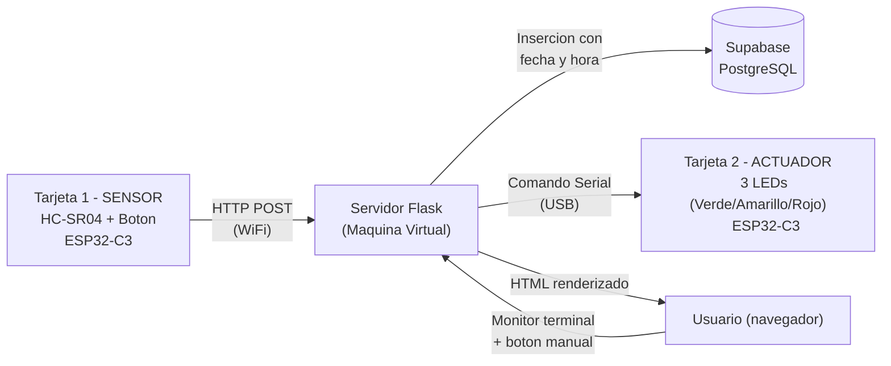

# Sistema IoT: Sensor de Distancia con Actuación y Registro en la Nube

## 1. ¿Qué es este proyecto?

Este proyecto es un sistema IoT que mide una variable física (distancia), la transmite de forma inalámbrica, la registra en una base de datos en la nube, y actúa físicamente en base a esa medición. Está compuesto por dos tarjetas ESP32-C3, un backend en Flask (Python), y una base de datos en Supabase.

## 2. Explicación del sistema

1. La **Tarjeta 1 (Sensor)** mide distancia con un sensor ultrasónico HC-SR04 de forma automática cada 3 segundos (o al presionar un botón físico como gatillo manual).
2. Esa medición se envía por **WiFi usando el protocolo HTTP** (petición `POST`) hacia el servidor Flask que corre en la máquina virtual.
3. **Flask** recibe el dato, lo **inserta en Supabase** (base de datos relacional PostgreSQL en la nube) junto con la fecha y hora exacta del evento, y clasifica la distancia en un rango (cerca / medio / lejos).
4. Según esa clasificación, Flask envía un comando simple por **conexión Serial (USB)** a la **Tarjeta 2 (Actuador)**, indicándole qué LED encender.
5. La **Tarjeta 2** enciende físicamente uno de sus **3 LEDs** (verde, amarillo o rojo) representando el estado del sistema.
6. La interfaz web de Flask muestra un **monitor estilo terminal** con el estado actual, la última medición, y el historial reciente traído directamente desde Supabase. Además incluye un botón de **activación manual**, que permite disparar una alerta de prueba en la Tarjeta 2 directamente desde la interfaz, sin depender del sensor.

## 3. Rol de cada tarjeta

- **Tarjeta 1 — Sensor**: mide la distancia y la transmite por WiFi/HTTP. Su única función es adquirir el dato físico y reportarlo.
- **Tarjeta 2 — Actuador**: recibe órdenes por Serial (USB) desde Flask y enciende el LED correspondiente (verde=lejos, amarillo=medio, rojo=cerca). No mide nada ni usa WiFi; su rol es exclusivamente de salida/actuación.

## 4. Diagrama del sistema



La Tarjeta 1 nunca se comunica directamente con la Tarjeta 2; todo pasa por Flask, que actúa como el "cerebro" central del sistema. Supabase solo es alcanzado por Flask (requiere internet); las tarjetas nunca hablan directo con la nube.

## 5. Instrucciones para ejecutar el proyecto

### Requisitos previos

- Arduino IDE con soporte para ESP32 (board `ESP32C3 Dev Module`) instalado.
- Python 3.10+ en la máquina virtual.
- Una red WiFi 2.4GHz (en este proyecto se usó un hotspot de celular Android abierto, sin contraseña).
- Cuenta y proyecto creado en [Supabase](https://supabase.com) con una tabla llamada `mediciones`:

```sql
create table mediciones (
  id bigint generated always as identity primary key,
  distancia float4 not null,
  created_at text not null
);
```

### Paso 1: Configurar y subir el código a las tarjetas

1. Abre `tarjeta1_sensor.ino` en Arduino IDE.
   - Reemplaza `ssid` con el nombre de tu red WiFi (2.4GHz).
   - Reemplaza `servidorURL` con la IP local de tu máquina virtual y el puerto (`http://IP_DE_TU_VM:5000/api/lectura`).
   - Sube el sketch a la Tarjeta 1, conectada al HC-SR04 (pines TRIG=2, ECHO=3) y al botón (pin 7).
2. Abre `tarjeta2_actuador.ino` en Arduino IDE.
   - No requiere configuración adicional (no usa WiFi).
   - Sube el sketch a la Tarjeta 2, conectada a los 3 LEDs (pines 4, 5 y 6).
   - Deja la Tarjeta 2 conectada por **USB a la máquina virtual** (necesario para que Flask le mande comandos por Serial).

### Paso 2: Preparar el entorno Flask en la máquina virtual

```bash
pip install flask supabase pyserial
```

Crea un archivo `.env` (no se sube al repositorio) con tus credenciales:

```
SUPABASE_URL=https://tu-proyecto.supabase.co
SUPABASE_KEY=tu_api_key_aqui
```

### Paso 3: Ejecutar el servidor

```bash
python3 app.py
```

Verifica en consola que:
- Se detecta la Tarjeta 2 en el puerto Serial (ej: `/dev/ttyACM0`).
- El servidor queda escuchando en `0.0.0.0:5000`.

### Paso 4: Acceder al monitor

Desde cualquier navegador en la misma red, entra a:

```
http://IP_DE_TU_VM:5000
```

### Paso 5: Probar el sistema

- Espera unos segundos: la Tarjeta 1 enviará automáticamente una medición cada 3 segundos.
- Observa cómo el LED correspondiente se enciende en la Tarjeta 2.
- Verifica en la tabla `mediciones` de Supabase que los registros se están guardando con su fecha y hora.
- Presiona el botón **"Forzar Alerta Manual"** en la interfaz web para probar la activación remota desde Flask.
